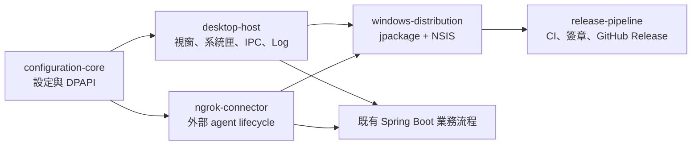

# 實作計畫：LINE AI 自動化報價系統

狀態：Task 1–18 實作、文件、自動驗證與本機瀏覽器驗收完成；外部 LINE／AI 及成功實機 PDF 的環境限制已記錄
依據：[正式 SRS](../docs/08-quotation-automation-srs.md)

## 1. 概要

本計畫將現有的 Excel 範本產生器與本機主檔管理功能，擴充成可由 LINE 一對一對話完成的正式報價流程。
實作採垂直切片，每個切片都包含資料、服務、入口與測試，並在每 2 至 4 個任務後執行完整測試與人工驗證。

現有系統可保留並擴充的基礎包括：

- 五份單工作表 XLSX 範本與已驗證座標。
- CNS 21 筆、一般架 20 筆固定品項主檔。
- AI 固定 JSON、圖片評分與資料庫主檔解析雛形。
- 圖片 `.pending`、正式資產、相對路徑與檔案同步機制。
- 本機管理頁、Excel 產生器及完整測試框架。

本輪已完成的擴充包括：

- 可恢復的 LINE 一對一多輪草稿、缺漏補件、圖片決策、簽章 postback 與事件冪等。
- 五格式確定性計價、完整鎖價列、正式快照、日期流水號、分頁與安全圖片嵌入。
- SQLite 持久 generation job、租約單工作者、Microsoft Excel PDF 匯出、outbox、Flex 交付與管理重試。
- 正式候選圖儲存範圍、檔案／DB 補償、本機管理頁與結構化日誌／AI 成本稽核。

## 2. 架構決策

### 2.1 AI 與程式責任分離

- AI 只輸出 2.x 固定契約：欄位 patch、品項意圖、缺漏、圖片評分及建議動作。
- 後端以白名單將 `nextAction` 轉成狀態機事件；AI 不能直接改狀態或呼叫任意函式。
- 固定主檔、複價、稅額、總額、流水號、檔名及路徑由程式決定。

### 2.2 單一 SQLite 與不可變快照

- 沿用現有 SQLite，增量擴充草稿、正式報價、流水號、檔案、下載權杖及 LINE 傳送紀錄。
- 正式確認在單一資料庫交易中分配流水號並建立報價快照。
- 標準品項保存來源外鍵與完整快照；臨時／動態品項只保存快照。

### 2.3 檔案提交採暫存後發布

- 草稿圖片只位於 `.pending`。
- 正式確認後先建立 `報價單/YYYYMMDD-XX/.working-*` 暫存內容。
- Excel、候選原圖、PDF 與資料庫狀態依序完成後，再發布為正式檔名。
- 失敗以補償方式清理暫存或恢復資產路徑；PDF 失敗是可重試狀態，不刪除 Excel。

### 2.4 Microsoft Excel PDF 邊界

- Java 只呼叫受控的本機 PowerShell 轉檔程序，傳入已驗證的絕對 XLSX 與 PDF 路徑。
- 程序使用隱藏 Excel.Application、唯讀開啟、固定 `ExportAsFixedFormat`、`finally` 關閉 COM。
- 不接受使用者提供命令片段，不透過 Shell 組合未跳脫字串。

### 2.5 LINE 交付

- LINE webhook 只在 `source.type=user` 建立或操作報價。
- 補充、取消、確認及重試使用簽名 postback；message ID 與 postback event ID 冪等。
- LINE 不支援直接傳 PDF，因此用 Flex Message 顯示摘要並提供 HTTPS 權杖下載。
- 圖片預覽使用 LINE image message 的 HTTPS 原圖與縮圖網址。

### 2.6 Excel 分頁

- 以各範本明細列容量為分頁單位，不以固定 30 筆硬編碼。
- 先建立「頁面模型」，再由 OOXML 寫入器複製範本頁面區塊。
- 只有最後一頁寫入合計與底部資訊；圖片空間不足時建立圖片頁。
- 所有可改寫範圍白名單化，固定媒體及聯絡資訊保持原封裝內容。

## 3. 依賴圖

```text
Task 1 Schema 與資料遷移
├─ Task 2 AI 2.x 契約與缺漏驗證
│  └─ Task 4 草稿狀態機
│     ├─ Task 5 LINE 補充／取消訊息
│     ├─ Task 6 Webhook 私訊與 postback 路由
│     └─ Task 7 OCR／候選圖片流程
├─ Task 3 程式計價與五格式列模型
│  └─ Task 8 確認、流水號與正式快照
│     ├─ Task 9 報價資料夾與圖片正式歸檔
│     └─ Task 10 Excel 完整品項與動態品項
│        └─ Task 11 Excel 分頁與圖片嵌入
│           └─ Task 12 Microsoft Excel PDF 匯出
├─ Task 13 PDF 安全下載
│  └─ Task 14 LINE Flex 交付
└─ Task 15 管理 API
   └─ Task 16 管理頁

Task 17 端對端與實體檔案驗收依賴 Task 1–16
```

## 4. 階段與任務

### Phase A：資料與契約基礎

- [x] Task 1：遷移草稿、快照、流水號與交付資料模型。
- [x] Task 2：升級 AI／OCR 2.x 契約與缺漏清單。
- [x] Task 3：建立程式計價與五格式報價列模型。

### Checkpoint A

- [x] Schema 可重複啟動，既有資產及主檔資料不遺失。
- [x] AI 金額與額外欄位會被拒絕。
- [x] 五種格式的純程式列模型與金額測試通過。
- [x] `./mvnw.cmd test` 與 `./mvnw.cmd -DskipTests package` 通過。
- [x] 使用者已核准 SRS 與資料契約。

### Phase B：LINE 多輪草稿

- [x] Task 4：實作草稿狀態機、合併 patch、確認與取消冪等性。
- [x] Task 5：實作 LINE 缺漏詢問、圖片詢問、確認與取消訊息。
- [x] Task 6：接入一對一 webhook、postback 與事件冪等路由。
- [x] Task 7：接入名片 OCR、候選圖片及最佳圖片預覽。

### Checkpoint B

- [x] 一對一文字與名片可分多輪補齊；群組不能建立報價。
- [x] 船用／空白一定詢問圖片，明確拒絕後才跳過。
- [x] 取消按鈕在每個等待狀態可用，舊確認按鈕不能復活草稿。
- [x] Mock LINE 整合測試及完整測試通過。
- [x] LINE 對話文字與完整預覽契約已有測試。

### Phase C：正式確認與檔案產出

- [x] Task 8：實作交易式每日流水號、正式快照與 15 天有效期限。
- [x] Task 9：實作日期流水資料夾及候選圖片正式歸檔。
- [x] Task 10：改造 Excel 產生器支援完整鎖價列、刪除與動態品項。
- [x] Task 11：實作 Excel 自動分頁與安全圖片嵌入。
- [x] Task 12：實作 Microsoft Excel 背景 PDF 匯出及原號重試。

### Checkpoint C

- [x] 並行確認不重號，取消草稿不耗號。
- [x] 每張候選原圖只有一份正式檔案，資產 DB 路徑正確。
- [ ] 五種 Excel／PDF 的資料、頁數、圖片、合計及固定資訊通過實體 Excel 驗證。
- [x] PDF 失敗會保留 Excel 並可重試。
- [x] 完整測試 309/309 與打包通過。

### Phase D：安全交付與管理

- [x] Task 13：實作 PDF／圖片 HTTPS 權杖下載與撤銷。
- [x] Task 14：實作 LINE 報價摘要、圖片預覽及 PDF Flex 交付。
- [x] Task 15：實作報價查詢、預覽、重試與權杖管理 API。
- [x] Task 16：擴充本機管理頁的報價管理功能。

### Checkpoint D

- [x] 到期或撤銷權杖無法下載，正常權杖不暴露本機路徑。
- [x] LINE 發送失敗可重試且不重建報價。
- [x] 管理頁可查詢、下載、重試 PDF／LINE 並撤銷連結。
- [x] 桌面與窄螢幕瀏覽器零 console error，且沒有水平溢位。

### Phase E：完整驗收

- [x] Task 17：AC-01 至 AC-22 證據矩陣與文件同步完成；外部／人工證據限制已逐項標示。

### Checkpoint E

- [x] 所有 309 項自動測試通過，且打包成功。
- [ ] 五種 Excel 與 PDF 通過試算表工具及 Microsoft Excel 實際驗證。
- [ ] LINE 沙盒的一對一補充、取消、圖片、確認與下載流程通過。
- [x] 文件、環境變數及故障排除指南與實作一致。
- [x] AC-01 至 AC-22 證據矩陣已定稿；未取得的外部／人工證據維持「部分通過」。

## 5. 風險與緩解

| 風險 | 影響 | 緩解方式 |
| --- | --- | --- |
| SQLite 舊表的 CHECK 與 NOT NULL 無法原地修改 | 高 | 使用新表搬移、欄位盤點與真實舊 DB 升級測試，禁止刪除未知資料 |
| Microsoft Excel COM 掛起或殘留程序 | 高 | 單次逾時、隱藏視窗、`finally` 關閉、序列化工作佇列及程序層測試 |
| OOXML 分頁破壞圖片、關聯或列印區 | 高 | 先做最小雙頁驗證，逐格式 artifact-tool、Excel COM 及 PDF 渲染比對 |
| 檔案搬移成功但 DB 更新失敗 | 高 | 暫存發布、補償動作、檔案識別表及同步修復測試 |
| LINE 重送 webhook 或重複點擊 | 高 | event/message ID 唯一鍵、狀態版本與冪等 postback |
| 公開下載連結洩漏 | 高 | 256-bit 隨機權杖雜湊保存、期限、撤銷、no-store 與不記錄完整權杖 |
| AI 合併多輪資料時覆蓋已確認值 | 中 | patch 限定本次來源、欄位來源追蹤、衝突進入確認而非靜默覆蓋 |
| 200 筆動態品項造成過多頁面 | 中 | 入口上限、分頁模型壓力測試及 PDF 產生逾時 |
| LINE image message 需要 HTTPS | 中 | 啟動時驗證 `PUBLIC_BASE_URL`，未設定則顯示可操作錯誤而非發送壞連結 |

## 6. 不在本次實作範圍

- 長寬高、周長、體積或工程公式自動推算。
- 免稅、含稅反推或非 5% 稅率。
- 群組內建立或修改報價。
- 將臨時或銷售品項自動加入主檔。
- 雲端 Office、Google Sheets 或 LibreOffice PDF 備援。

## 7. 計畫審核項目

- 任務依賴是否符合實際使用優先順序。
- 每個 Checkpoint 是否需要使用者實際操作驗收。
- 是否接受先完成 CNS／一般架，再擴充船用／空白／銷售；本計畫預設每個共用切片同時覆蓋五種格式，避免形成第二套流程。

## 8. 核准後新增：本機結構化日誌與 AI 成本稽核

- 日誌預設寫入程式根目錄下的 `log/`，並由 `.gitignore` 排除，不提交互動紀錄。
- 每次 LINE 互動使用 correlation ID 串接 webhook、AI/OCR、資料庫、圖片、Excel、PDF 與 LINE 回覆事件。
- 以 JSON 結構化事件記錄流程狀態、外部網路請求結果與延遲、JVM／記憶體／磁碟等資源快照。
- AI 用量記錄模型、輸入 token、輸出 token、快取 token、總 token，以及依當次模型費率快照在本機公式計算的估算金額。
- 模型費率採可設定的每百萬 token 單價；未知模型不得猜價格，需明確標記未設定。
- 日誌採欄位白名單與遮罩，不保存 API Key、LINE token、下載 token、完整個資、完整訊息本文或圖片內容。
- 加入輪替與保留上限，避免長期執行耗盡磁碟；健康檢查與管理頁顯示日誌／資源摘要。

## 9. Windows 商用 App 與 GitHub Release

本節對應已核准的 [Windows App 能力地圖](../CAPABILITY-MAP-windows-app-distribution.md)及五份 `SPEC-*.md`。既有 Server／Docker 啟動方式必須保持可用；Windows 桌面模式是新增的啟動邊界，不重寫 LINE、報價或資料庫業務流程。

### 9.1 架構決策

#### 9.1.1 雙啟動模式

- 新增 desktop bootstrap，負責設定、單一執行個體、ngrok、Spring context 與 UI 生命週期。
- jpackage 產生的 Windows launcher 明確啟用 desktop mode。
- Docker 與命令列部署明確停用 desktop mode，沿用現有環境變數與 Spring Boot server 流程。
- 設定變更採完整程序受控重啟，確保 Logback、SQLite、資料根目錄及 Spring properties 使用同一份新設定。

#### 9.1.2 設定與機密資料

- 一般設定存於 `%LOCALAPPDATA%\AssetsManagerLinebot\config\application.properties`。
- 機密值由 `DpapiSecretStore` 透過鎖定版本的 JNA Platform 呼叫 Windows DPAPI，密文存於 `secrets.dat`。
- desktop bootstrap 在建立 Logger、ngrok 或 Spring context 前載入設定；正式 App 不依賴安裝目錄內的 `.env`。
- 設定保存採驗證、暫存寫入、原子替換；失敗時保留上一版。

#### 9.1.3 單一執行個體與桌面 UI

- 第一個程序取得使用者設定目錄內的 FileLock，並建立只綁定 loopback 的 IPC endpoint。
- IPC metadata 包含隨機 Port 與每次啟動產生的 nonce；第二個程序只能要求顯示視窗或開啟設定。
- Swing UI 僅操作 lifecycle facade，不直接存取 Repository 或業務 Service。
- 視窗關閉時隱藏至 SystemTray；若作業系統不支援系統匣，主視窗不得被完全隱藏。
- Log viewer 追蹤既有 JSON rolling file，保留固定筆數的記憶體 buffer，避免長期執行耗盡記憶體。

#### 9.1.4 ngrok 邊界

- 不在 Setup 內封裝、下載或再散布 ngrok agent。
- 使用者選擇 agent executable；ProcessBuilder 使用固定參數陣列，Authtoken 只放入 child environment。
- ngrok 在 Spring context 前建立 tunnel 並回傳公開 HTTPS URL；Spring 啟動時取得最終 `PUBLIC_BASE_URL`。
- 程式只停止自己建立且持有 ProcessHandle 的 ngrok child process。

#### 9.1.5 Windows 封裝與維護

- Maven 先產生 Spring Boot fat JAR；`jpackage --type app-image` 產生包含 Java Runtime 的 app image。
- NSIS 只負責把 app image 包成單一 Setup.exe、建立捷徑、維護入口及安全移除。
- 採 per-user 安裝至 `%LOCALAPPDATA%\Programs\AssetsManagerLinebot`，避免要求 UAC。
- 同一份 Setup 偵測既有安裝後提供編輯設定、修復／升級與移除。
- Microsoft Excel COM 與可用印表機屬於 PDF 功能的外部先決條件；缺少時警告但不阻擋其他功能。
- 預設解除安裝保留設定與資料；完整清除必須由使用者明確勾選，且只刪除驗證後的產品專屬路徑。

#### 9.1.6 Release 與簽章

- CI 對 Pull Request 與 main 執行 Maven Wrapper 完整驗證；Windows job 補充 DPAPI 與封裝相容測試。
- Release workflow 僅接受 `v<major>.<minor>.<patch>` Tag，並驗證 Tag、Maven、launcher 與 Setup 版本一致。
- GitHub Actions 第三方 Action 鎖定完整 commit SHA；PR job 不取得簽章秘密或寫入權限。
- 正式 Release 必須驗證 Authenticode 後才發佈；對外資產只有一份 Setup.exe，SHA-256 寫入 Release Notes。
- 簽章 provider 由 PowerShell 邊界抽象，支援本機／CI 的 PFX SignTool，日後可替換為核准的雲端簽章。

### 9.2 依賴圖



### 9.3 分階段垂直切片

#### Phase W1：建立可驗證的設定核心

- 建立設定模型、欄位分類、驗證與路徑契約。
- 先以測試 SecretStore 完成跨平台單元測試，再接 Windows DPAPI integration。
- 建立首次設定與編輯設定的最小 Swing wizard，可保存並重新載入。
- 保持現有 `.env`／Docker 啟動測試通過。

Checkpoint W1：全新設定、錯誤設定、原子保存、DPAPI round trip、敏感資料掃描及 server mode regression 全部通過。

#### Phase W2：建立可背景執行的桌面 App

- 建立 desktop bootstrap 與 Spring context lifecycle facade。
- 建立單一執行個體 FileLock／IPC，再接主視窗與系統匣。
- 接入既有健康狀態與 JSON Log tail；第二次開啟只顯示既有視窗。
- 設定儲存後完成受控程序重啟，並驗證資料庫鎖與 Port 已釋放。

Checkpoint W2：Windows 上只存在一個後端；關閉視窗後 webhook 持續；再次開啟可顯示 Log；明確結束後資源全部釋放。

#### Phase W3：加入可選 ngrok

- 先以假 executable 與本機 HTTP stub 完成 process／API 契約測試。
- 接入 agent 路徑驗證、timeout、公開 URL 解析、狀態與錯誤選項。
- 把公開 URL 注入 Spring 啟動設定，顯示可複製 callback URL。
- 驗證未啟用時完全不接觸 ngrok，結束時不影響其他 ngrok session。

Checkpoint W3：ngrok 成功、失敗、本機模式與重啟四條路徑可重現，所有 Log 均不含 Authtoken。

#### Phase W4：建立單一 Setup.exe

- 建立可重現的 app image script，先在無系統 JRE 的環境執行 smoke test。
- 建立 NSIS 初次安裝與維護模式，再接停止既有 App、升級保留與安全移除。
- 加入 Microsoft Excel／印表機非阻擋式先決條件提示。
- 驗證 App、Runtime、license 與 third-party notices 都包含在 Setup。

Checkpoint W4：乾淨 Windows VM 完成 install、configure、run、hide、reopen、edit、repair、upgrade、uninstall 與選擇性 purge。

#### Phase W5：建立 CI/CD 與商用 Release gate

- 建立 `ci.yml`，固定 JDK 25 與 Maven Wrapper，執行跨平台與 Windows 專用測試。
- 建立版本一致性、SBOM、第三方授權、NSIS checksum 與 Release 組裝檢查。
- 建立 provider-neutral 簽章 script 與 protected Environment release job。
- 建立 `release-windows.yml`、Release Notes checksum、失敗清理及回復 runbook。

Checkpoint W5：測試 Tag 可產生未公開的安裝 artifact；具備正式憑證後，正式 Tag 只發佈一份已簽章 Setup.exe。

#### Phase W6：商用驗收

- 在未安裝 Java 的 Windows 10/11 x64 VM 驗證完整生命週期。
- 在有／無 Microsoft Excel 與可用印表機的環境驗證 PDF 狀態及實際匯出。
- 以專用測試 LINE Channel、AI Key 與 ngrok Token 驗證完整 webhook 與 Log 追蹤。
- 完成 EULA、Publisher、icon、支援資訊、第三方 notices、弱點掃描與回復演練。

Checkpoint W6：所有規格 Success Criteria、安裝驗收矩陣與 Release checklist 通過，才允許標記正式商用版本。

### 9.4 順序與平行化

- W1 必須先完成，因為 desktop 與 ngrok 都依賴同一設定契約。
- W2 的 UI／IPC 與 W3 的 fake-agent connector 可在 W1 後平行，但注入 Spring 的啟動順序需共同驗收。
- W4 必須等待 desktop launcher 與 ngrok lifecycle 穩定，避免把未定契約寫死在 installer。
- W5 的 CI 基礎可提早建立；正式 package、簽章與 Release job 必須等待 W4。
- W6 需要使用者提供正式品牌、簽章資格與測試用外部服務憑證。

### 9.5 風險與緩解

| 風險 | 影響 | 緩解 |
|---|---|---|
| DPAPI bridge 新增 native 依賴 | 高 | 鎖定 JNA 版本與 checksum／授權，介面隔離，Windows round trip 測試 |
| 設定在 Spring／Logback 啟動後才載入 | 高 | desktop bootstrap 在任何 Logger 與 ApplicationContext 前載入，設定變更採程序重啟 |
| 第二個程序造成 SQLite 或 Port 衝突 | 高 | FileLock 先於 Spring，loopback IPC 僅傳顯示／設定命令，整合測試雙啟動 |
| ngrok 啟動成功但未取得 HTTPS URL | 高 | 有限重試與 timeout，URL schema 驗證，明確提供重試／設定／本機模式 |
| 升級時 App 或 Excel COM 仍占用檔案 | 高 | IPC 正常停止、有限等待、明確提示；不得靜默強制刪除使用者資料 |
| jpackage runtime 缺少必要 JDK module | 高 | 先建立未裁切的可用 runtime，對 app image 執行完整 smoke test後再考慮縮減 |
| GitHub runner 沒有 Excel／印表機 | 中 | CI 測 adapter 與失敗邊界；實際 PDF 列為 Windows VM 人工 release gate |
| 未簽章 App 被 SmartScreen 阻擋 | 高 | 測試 artifact 與正式 Release 分流；正式 Tag 缺少簽章即失敗 |
| NSIS 或 Action 供應鏈被替換 | 高 | 鎖定版本、來源、commit SHA 與 checksum；Release 保存 SBOM／attestation |
| 現有工作樹有大量未提交變更 | 高 | 每個切片只碰預列檔案，修改前檢查 diff，不覆寫或重設既有內容 |

### 9.6 計畫核准項目

- 接受新增鎖定版本的 JNA Platform 作為 Windows DPAPI bridge。
- 接受 Windows desktop 與現有 server／Docker 雙啟動模式。
- 接受設定變更採完整程序受控重啟，而非熱更新 Spring bean。
- 接受 Microsoft Excel／印表機為 PDF 功能的非阻擋式外部先決條件。
- 接受正式公開 Release 缺少可信任簽章時直接失敗。
- 接受直到 Phase W6 才使用真實 LINE／AI／ngrok 測試憑證，且憑證不進入版本庫或一般 CI。
